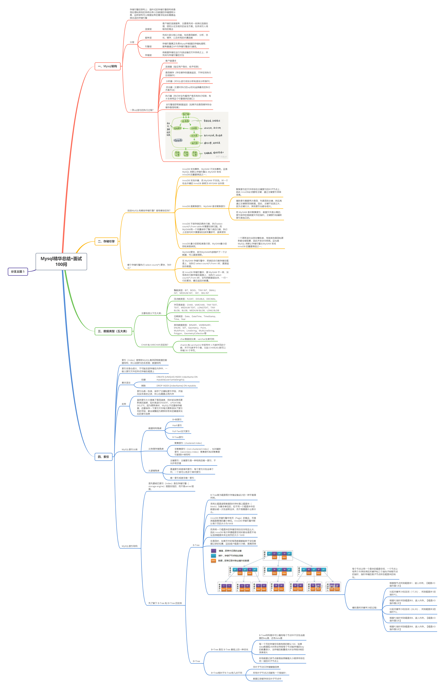

# JavaLearning

#### 春招、秋招、实习java后端开发基础面试必备

#### 记录java后端学习笔记，主要是经典书籍的脑图。

图片本身较大，网页查看不清晰，建议下载到本地阅读

+ [面试必问JVM虚拟机](./doc/深入理解Java虚拟机：JVM高级特性与最佳实践.md)                     [原书pdf](./book/深入理解Java虚拟机：JVM高级特性与最佳实践周志明.pdf)

+ [Redis缓存中间件](./doc/Redis开发与运维.md)        [原书pdf](./book/Redis开发与运维.pdf)

+ [Dubbo框架](./doc/Dubbo.md)             

+ [RabbitMQ](./doc/RabitMQ.md)           

